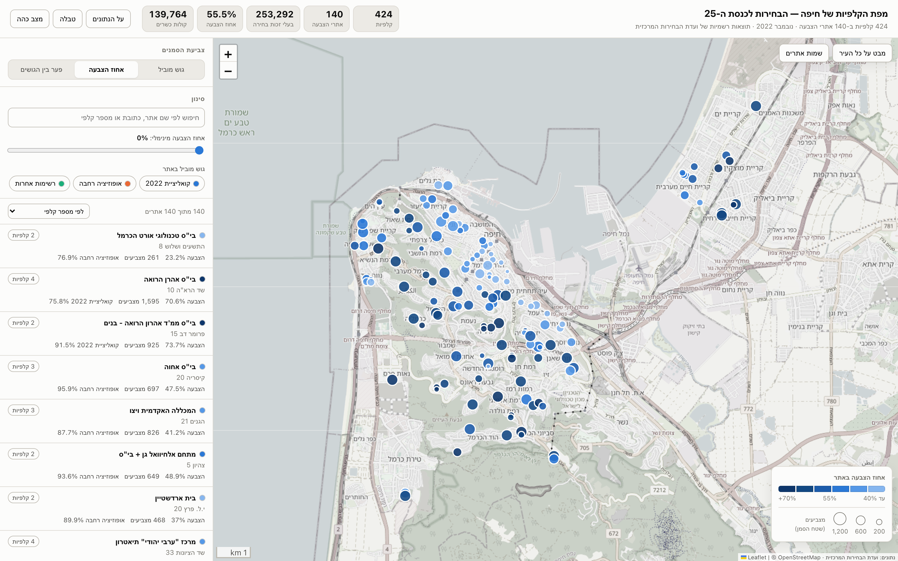

# מפת הקלפיות — הכנסת ה-25

Single-file, self-contained HTML maps of every polling station in a city in the November
2022 Knesset election, grouped into the polling sites where they operated, with official
results, turnout and a full per-party breakdown for every station.

Open the map file in any browser — no server, no build step, no API key. The file embeds
Leaflet and the whole dataset; only the OpenStreetMap background tiles need an internet
connection.

**Live:** <https://dadonofek.github.io/2022_elections/>



## Cities

One pipeline, one front end, one city per built file. Cities are entries in
`config.CITIES`; pick one with the `CITY` environment variable (default `haifa`).

| city | slug | stations | sites | eligible | turnout | map |
|---|---|---|---|---|---|---|
| חיפה | `haifa` | 424 | 140 | 253,292 | 55.53% | `haifa_polling_map.html` ✅ built |
| בית שמש | `beit_shemesh` | 133 | 44 | 78,064 | 66.13% | `beit_shemesh_polling_map.html` ✅ built |

Beit Shemesh is fully built from the two official national files (see Provenance): all
133 stations are grouped into 44 mapped polling sites. All 44 addresses have coordinates;
6 sites are snapped to named OSM venues, 5 to houses, 30 to streets and 3 to approximate
places. The map records that precision per site rather than presenting every result as an
exact building location.

## What the map shows

* **One marker per polling site.** Marker **area** is proportional to the number of
  **eligible voters** the site serves (not the number who voted), so a large pale
  marker in turnout mode is a big electorate that largely stayed home. The area means
  that in **every** mode — only the marker **color** follows the selected mode, so
  switching modes never resizes the map.
* **הדמוקרטים as a group of its own.** The `הגוש שלי` selector that picks whose non-voters
  to count keeps all four choices it always had — nobody, the 2022 coalition, the broad
  opposition, the other lists — and adds **הדמוקרטים** (העבודה + מרצ), which is the default.
  Picking it points the potential, the marker colour, the list, the legend and the marker
  card at that group. It is **not** a fourth bloc — הדמוקרטים sits *inside* the broad
  opposition, so the bloc split, *גוש מוביל*, *פער בין הגושים* and the filter chips keep
  partitioning the vote three ways, and the group is shown beside them, labelled as the
  subset it is. It also gets a hue of its own — **teal** — because a group painted in its
  parent bloc's colour would say "opposition" while the legend said "הדמוקרטים". Its header
  tile, sort, two table columns, site-card bar and bloc-split line are always present,
  whichever group the map is currently painting. הדמוקרטים did not exist in 2022 (העבודה and
  מרצ ran separately, and מרצ missed the threshold): the sum is a retrospective construct,
  and the UI says so where it is picked, in the site card and in *על הנתונים*.
* **Five color modes** (*פוטנציאל* is the default)
  * *פוטנציאל* — how many votes are sitting at this site and did not turn up:
    `eligible x (1 - turnout) x the group's share of the votes cast here`. A
    `הגוש שלי` selector picks whose votes to count — הדמוקרטים by default, any of the
    three blocs, or nobody, which shows raw non-voters.
    Hue says *which* group and lightness says *how many*, while the marker area keeps
    carrying the electorate — so a large dark marker is a big electorate with a lot of
    it still on the table, and a small dark one is a small electorate that barely voted.
    **It is an estimate, not a forecast** — see the caveats in *על הנתונים*.
  * *אחוז הצבעה* — turnout, as a **purple** light→dark ramp, deliberately not a bloc
    colour so it never reads as "everything voted for one party".
  * *פער מהארצי* — each site against the **national** turnout of the same election
    (70.63%), as a rose deficit ramp with one neutral step for sites at or above it.
    The baseline is national, not the city's own mean, because against the city mean
    half the sites sit above it by construction and nothing reads as low. The gap
    from the city average is shown too, per site and in the table.
  * *גוש מוביל* — which bloc led at the site (categorical: the broad opposition is
    **blue**, the 2022 coalition **orange**, other lists **green**).
  * *פער בין הגושים* — coalition-minus-opposition margin, a diverging orange<->blue
    scale with a neutral gray midpoint, reusing the two bloc hues.
* **Filters** by free text (site name, address, station number or "iron" number),
  a turnout **range** (min *and* max sliders), and leading bloc. The list, the
  markers, the legend counts and the table all follow the active filter. The list
  is sorted by **potential, descending** by default, so it reads as a task list.
* **Mobile**: below 1000px the map and the list are separate tabs (*מפה* / *רשימה*),
  the filters fold into a collapsible section, the secondary controls move into a
  hamburger, and the header shows three statistics with the rest behind *עוד*.
  Tapping a marker opens a **compact card on the map** — name, potential, turnout with
  its national delta, leading bloc — and the full site panel is reached only through
  that card's *כל הנתונים באתר* button, so identifying a circle never costs you the map.
  On a pointer device the marker keeps its hover tooltip and a click fills the panel
  beside the map. The **color mode** also gets its own select on the map bar in this
  layout (with the potential-target select beside it in potential mode), bound to the same
  state as the filter panel's segmented control — that panel is on the other tab, so
  picking a mode there meant three taps and no view of the map being painted.
* **Site detail** (click a marker or a list row): bloc split, largest parties, a
  collapsible per-station breakdown (*פירוט לפי קלפי*, collapsed by default), the full
  vote table, and the location accuracy for that site.
* **Table view** — every field for all 140 sites or all 424 stations, sortable by any column.
* **Site labels**, dark mode, and an **על הנתונים** panel documenting sources, bloc
  definitions and limitations.

Product requirements, the decisions taken on them and what was deliberately deferred
are recorded in **`PRODUCT_DECISIONS.md`** — read it before changing the metrics, the
palette or the mobile layout.

## Data layers, and the Haifa numbers

| Layer | Source |
|---|---|
| Votes, eligible voters, voters, valid/invalid per station | Central Elections Committee official per-station file (`expb.csv`, Knesset 25) |
| Station → site and address | Haifa: `haifa_polling_station_matching.xlsx` (built from Haifa's official election notice). Every other city: the committee's own station-place file — see Provenance |
| Address → coordinates | OpenStreetMap Nominatim |
| Site → building | OpenStreetMap Overpass, for sites whose venue name matched a named school / community centre / hall nearby |

Where the files come from and how they were cross-checked is in **Provenance** below.
All 424 rows of Haifa's spreadsheet were re-verified against `expb.csv`: station counts,
eligible voters and voters match exactly. Haifa's totals: 253,292 eligible, 140,650 voters,
**55.53% turnout**, 139,764 valid votes — and **112,642 non-voters**, a pool 80% the size
of the electorate that did vote.

The **national** turnout used as the delta baseline (70.63%) is recomputed by
`build_data.py` from all 12,545 stations in `expb.csv`; `config.NATIONAL_TURNOUT` is the
fallback when that file is absent.

**Location accuracy in Haifa** (per site, also shown in the UI): 35 snapped to an identified OSM
building, 13 exact house numbers, 80 street-centroid only, 12 approximate. A street-centroid
marker can sit tens to a few hundred metres from the actual building. Sites that geocoded to
the identical point are nudged a few metres apart so their markers stay separable.

Turnout here is that of Haifa's own ballot boxes; double-envelope and external ballots are
not included, so it is not the turnout of all Haifa residents.

## The pipeline

```sh
pip install -r requirements.txt
./build.sh                      # the default city, Haifa
CITY=beit_shemesh ./build.sh    # any other city in config.CITIES
```

`build.sh` runs seven stages in order. Each stage reads files from `data/<city>/` and
writes one file back there, so stages are independently re-runnable, two cities never
share a cache, and the network is only touched when a cache file is missing. Geocoding
results (`data/<city>/geocache.json`) and the Overpass reply (`data/<city>/osm_venues.json`)
are committed, so a normal rebuild is **offline and takes seconds**. Delete a cache file to
force a re-fetch; a cold geocoding run costs a few seconds per address (Nominatim is
rate-limited to 1 req/s) — about 15 minutes for Haifa's 134 addresses.

Two inputs are national and shared by every city: `data/expb.csv` (results per station)
and `data/kalpiplaces_25.xlsx` (each station's site, place name and address).

| # | Stage | Reads | Writes | Role |
|---|---|---|---|---|
| 1 | `extract.py` | the national files, or `config.MATCHING_XLSX` | `data/<city>/raw.json` | flatten one locality into stations + sites (see Provenance) |
| 2 | `geocode.py` | `raw.json` | `geocache.json` | address → coordinates via Nominatim, constrained to `config.BBOX` |
| 3 | `geocode_retry.py` | `geocache.json` | `geocache.json` | second pass for misses: expand abbreviations (שד→שדרות), drop honorifics (ד"ר), flip surname-first names, try spelling variants |
| 4 | `qa_geo.py` | `geocache.json` | — (report only) | assert every hit names `config.CITY_HE` and no two distinct streets share a point |
| 5 | `snap_osm.py` | `raw.json`, `osm_venues.json` | `osm_snaps.json` | match site names (schools, community centres…) to named OSM buildings in the bbox, accepted only when near the geocoded address |
| 6 | `build_data.py` | `raw.json` + `geocache.json` + `osm_snaps.json` | `map_data.json` | join all three, aggregate stations → sites, compute turnout / blocs / margin / marker data / map center |
| 7 | `build_map.py` | `src_map.html`, `src_app.js`, `vendor/*`, `map_data.json` | `config.OUT_HTML` | inline everything into one self-contained HTML file |

Stage 6 **refuses to build** when any site is left without coordinates — a site with no
coordinates has no marker, so a partly-geocoded city would render as a map that quietly
omits part of itself. Set `ALLOW_MISSING_COORDS=1` to build one deliberately.

`test_map.py` (stage 8, not in `build.sh`) renders `config.OUT_HTML` headlessly — see Tests.

**Front-end:** edit `src_map.html` (markup + styles) or `src_app.js` (behaviour), then
re-run `python3 build_map.py`. Never edit the generated HTML directly — it is overwritten.
The map view, turnout ramp bins and marker sizing live in `src_app.js`; the map center /
zoom come from `map_data.json` (set in `config.py`). Nothing in the front end names a
city: the `<title>` and `<h1>` are `__CITY_HE__` tokens substituted by `build_map.py`, and
every Hebrew sentence that mentions the city builds it from `DATA.city.name`.

## Provenance

Two official Central Elections Committee files cover the whole country for Knesset 25:

* **`data/expb.csv`** — results, iron number, eligible voters, voters, valid and invalid
  per polling station, for all 12,545 stations. Its `ריכוז` column is the **site** each
  station belongs to, which is what groups stations into map markers.
* **`data/kalpiplaces_25.xlsx`** — the committee's own station → place table: site number
  (`סמל רכוז`), place name (`מקום קלפי`) and address (`כתובת קלפי`) for all 11,707
  stations. Republished unaltered in [JacobWeinbren/Israel-Revised](https://github.com/JacobWeinbren/Israel-Revised)
  (MIT) after the committee took it off its own site.

Together these give any city its stations, its sites and their addresses with no
per-city preparation — this is what `extract.py`'s `cec` mode reads.

Haifa predates that discovery: it was built from a hand-made matching workbook
(`haifa_polling_station_matching.xlsx`) assembled from the city's official election
notice, and stays on it because the workbook also carries a per-site match confidence and
method that the map displays. The two sources were compared, and they agree:

| | |
|---|---|
| Stations present in both | 424 of 424 |
| Site groupings identical | 140 of 140 |
| Addresses identical | 421 of 424 |

Of the three differences, two are the one address the source PDF mangled
(`פרץ י .ל20,.`, which the committee's file spells `פרץ י. ל. 20` — confirming the
`ADDRESS_FIX` in `src_app.js`), and one is a real disagreement: station 742,
`גן "כוכבית"`, is `הפלוגות 14` in the workbook and `הקבוצים 63` in the committee's file.

## Adding a city

All city- and election-specific constants live in **`config.py`** — the pipeline scripts
hold none of their own. For another city in the **same election**:

1. Add an entry to `config.CITIES`: its Hebrew name, its locality code (`סמל ישוב` in
   `expb.csv`), a bounding box (`W, S, E, N`), an output filename and a `source_note` /
   `match_note` for the *על הנתונים* panel. Leave `extract` at `'cec'`. Optionally pin
   `center` / `zoom`.
2. `CITY=<slug> ./build.sh`. The cold geocode is the only slow part.
3. `CITY=<slug> python3 test_map.py` to sanity-check the render, and add the new map to
   `index.html`.

Nothing else changes: the station list, the site grouping, the place names and the
addresses all come from the two national files.

## Nationwide — in progress (third tab, כל הארץ)

The goal is a third tab beside חיפה and בית שמש: a map of the whole country, zooming
from one dot per locality down to individual polling sites, using the same two
national CEC files every city already reads — no per-city preparation needed.

**Extraction is done.** `national_extract.py` reads `expb.csv` + `kalpiplaces_25.xlsx`
for **every** locality (not just one, like `extract.py`) and writes
`data/national/raw.json`:

| | |
|---|---|
| Localities (the zoomed-out layer, no geocoding needed) | 1,216 |
| Polling sites with an address (the zoom-in layer) | 4,205 |
| Unique (locality, address) pairs to geocode | 3,762 |
| Stations with results but no usable address (folded into locality totals only) | 839, mostly `מעטפות חיצוניות` (double-envelope/external ballots) and localities the place file only partly covers |

**Geocoding is the blocker, and it cannot run in this sandboxed session** —
Nominatim, data.gov.il, govmap.gov.il, Geoapify and odata.org.il all fail here with
`403` / `EGRESS_BLOCKED` at the network-policy level (tested directly, not inferred).
`geocode_national.py` is written and ready — same approach as `geocode.py`, run over
every locality instead of one, resumable, ~70 minutes cold (3,762 addresses at
Nominatim's 1 req/s) — but it needs to run on a machine with normal internet access:

```sh
pip install -r requirements.txt
python3 national_extract.py     # already done; re-run only if the inputs change
python3 geocode_national.py     # run this part elsewhere — see its docstring
```

It writes `data/national/geocache.json`. Since there is no single bounding box for
the whole country, each hit is checked against the locality name Nominatim itself
returns (not a bbox) and marked `verified: true/false` — an unverified hit is kept
(so it is not re-fetched) but needs a manual look before being trusted, per the
"validate and label accuracy" step this was scoped around.

**Once `geocache.json` exists**, the remaining stages are the same shape as a city's:
aggregate to sites (`build_data.py`'s join, extended to loop over localities instead
of one `config.CITY_HE`), then a two-layer front end — locality dots at low zoom
(all 1,216, no coordinates needed beyond a per-locality centroid, which can come
from the geocoded sites themselves or a separate locality-coordinate source),
polling-site markers at high zoom for the 4,205 addressed sites. `PRODUCT_DECISIONS.md`
§9 has the reasoning already recorded, including the single-file-vs-per-city-fetch
fork this design needs to pick.

For a **different election**, also update `BLOCS`, `CAMPS` and `PARTY_NAMES` in `config.py`
with that election's party letter codes, and point `EXPB_CSV` / `KALPI_PLACES_XLSX` at that
election's files. `CAMPS` holds the groups that are not
blocs: each entry names one, the letter codes to sum for it, the bloc it sits inside and its
caveat. `DEFAULT_POT_TARGET` is the group the map opens on — a camp, a bloc, or `none`.
Adding a camp is a config edit: the front end inserts its option, tile, sort, columns and
bar from the data, and the blocs are untouched. A camp with its own party list also needs
a `--camp-<key>` colour and a `--pot-<key>-0..4` ramp in `src_map.html` plus its bin edges
in `POT_BINS`; validate any new ramp as described in `PRODUCT_DECISIONS.md` §5.4.

## Tests

```sh
python3 -m playwright install chromium        # once
python3 test_map.py                           # all scenarios, the default city
python3 test_map.py dark                      # one scenario
CITY=beit_shemesh python3 test_map.py         # another city's map
```

The suite renders `config.OUT_HTML`, so it follows `CITY` like every other stage, and it
asserts no fixed site count — it works for any city.

Thirty-six scenarios — light, dark, each of the five color modes, each potential
target, **both camps**, detail, labels, table, sorting, filter, search, marker interaction
on both touch and pointer layouts, and **thirteen phone scenarios at 390x844 with touch** — are
rendered headlessly and checked for JS errors, failed
requests, horizontal overflow, clipped controls, markers and tiles rendering, overlays
escaping their container, the table view covering the map, the sidebar sitting to the
right of the map under RTL, legend ramp labels running in the same direction as
their swatches, a marker tap on a phone opening its card without leaving the map, the
map-bar mode control staying in step with the panel's, and the marker radius not moving
when the color mode changes. The **full option list of both group selects and of the sort**
is pinned, so a group can never quietly go missing, and the camp's columns are asserted
present whichever group is selected.
Screenshots land in `build/`.

The phone scenarios assert controls are **reachable** — on screen, with real size — not
merely present in the DOM. An earlier suite checked `listItems == 140`, a count of DOM
nodes, and passed while the site list rendered at zero height off the bottom of every
phone screen.

Basemap tiles need the network; when they cannot be reached the row is marked `*` and
the tile assertions are skipped so the suite still runs offline. Set
`PLAYWRIGHT_CHROMIUM_PATH` to point the launcher at a specific Chromium when the
installed browser build does not match the installed Playwright.
